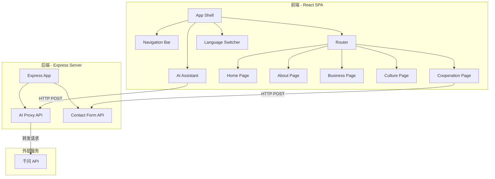

# 技术设计文档

## 概述

本设计文档描述华腾集团官方网站的技术架构和实现方案。网站采用前后端分离架构，前端使用 React + TypeScript + Vite 构建单页应用（SPA），后端使用 Node.js + Express 提供 API 服务（包括 AI 问答代理和联系表单提交）。网站支持中文简体、中文繁体、英文三种语言，整体视觉风格以深蓝色调为主，通过 CSS 变量实现可配置主题系统。

### 技术选型理由

- **React 18 + TypeScript**：组件化开发，类型安全，生态成熟，适合多页面 SPA 开发
- **Vite**：快速的开发服务器和构建工具，开发体验好
- **React Router v6**：客户端路由，支持无刷新页面切换
- **react-i18next**：成熟的 React 国际化方案，支持动态语言切换
- **Express**：轻量级 Node.js 后端框架，适合 API 代理和表单处理
- **CSS Modules + CSS Variables**：样式隔离 + 全局主题变量，兼顾模块化和可配置性

## 架构

### 整体架构



### 目录结构

```
huateng-website/
├── client/                     # 前端项目
│   ├── public/
│   │   └── 华腾集团logo.jpg
│   ├── src/
│   │   ├── components/         # 公共组件
│   │   │   ├── Navbar.tsx
│   │   │   ├── Navbar.module.css
│   │   │   ├── AIAssistant.tsx
│   │   │   ├── AIAssistant.module.css
│   │   │   ├── Footer.tsx
│   │   │   └── Lightbox.tsx
│   │   ├── pages/              # 页面组件
│   │   │   ├── Home.tsx
│   │   │   ├── About.tsx
│   │   │   ├── Business.tsx
│   │   │   ├── Culture.tsx
│   │   │   └── Cooperation.tsx
│   │   ├── i18n/               # 国际化
│   │   │   ├── index.ts
│   │   │   ├── zh-CN.json
│   │   │   ├── zh-TW.json
│   │   │   └── en.json
│   │   ├── styles/             # 全局样式
│   │   │   ├── theme.css       # CSS 变量定义
│   │   │   └── global.css
│   │   ├── hooks/              # 自定义 Hooks
│   │   │   └── useScrollAnimation.ts
│   │   ├── services/           # API 调用
│   │   │   └── api.ts
│   │   ├── App.tsx
│   │   └── main.tsx
│   ├── index.html
│   ├── vite.config.ts
│   ├── tsconfig.json
│   └── package.json
├── server/                     # 后端项目
│   ├── src/
│   │   ├── index.ts
│   │   ├── routes/
│   │   │   ├── ai.ts
│   │   │   └── contact.ts
│   │   └── middleware/
│   │       └── cors.ts
│   ├── tsconfig.json
│   └── package.json
├── .env.example                # 环境变量模板
└── README.md
```

## 组件与接口

### 前端组件

#### 1. App Shell (`App.tsx`)

应用根组件，负责整体布局编排。

```typescript
// 职责：路由配置、全局布局（Navbar + 页面内容 + AI Assistant）
const App: React.FC = () => {
  return (
    <I18nextProvider i18n={i18n}>
      <BrowserRouter>
        <Navbar />
        <main>
          <Routes>
            <Route path="/" element={<Home />} />
            <Route path="/about" element={<About />} />
            <Route path="/business" element={<Business />} />
            <Route path="/culture" element={<Culture />} />
            <Route path="/cooperation" element={<Cooperation />} />
          </Routes>
        </main>
        <Footer />
        <AIAssistant />
      </BrowserRouter>
    </I18nextProvider>
  );
};
```

#### 2. Navbar 组件

```typescript
interface NavbarProps {}

// 职责：
// - 左侧展示 Logo，点击导航回首页
// - 右侧展示页面导航链接，高亮当前页面
// - 右侧展示语言切换下拉菜单
// - 移动端折叠为汉堡菜单
```

#### 3. AI Assistant 组件

```typescript
interface Message {
  role: 'user' | 'assistant';
  content: string;
}

interface AIAssistantState {
  isOpen: boolean;
  messages: Message[];
  inputValue: string;
  isLoading: boolean;
  error: string | null;
}

// 职责：
// - 右下角折叠按钮，点击展开聊天界面
// - 发送用户消息到后端 AI 代理接口
// - 展示 AI 回复，支持加载状态和错误处理
```

#### 4. Lightbox 组件

```typescript
interface LightboxProps {
  images: string[];
  currentIndex: number;
  isOpen: boolean;
  onClose: () => void;
  onPrev: () => void;
  onNext: () => void;
}

// 职责：全屏灯箱展示图片，支持前后切换和关闭
```

#### 5. ContactForm 组件

```typescript
interface ContactFormData {
  name: string;
  phone: string;
  organization: string;
  intention: string;
}

interface ContactFormErrors {
  name?: string;
  phone?: string;
  organization?: string;
  intention?: string;
}

// 职责：
// - 表单字段渲染和双向绑定
// - 客户端表单验证（必填校验、手机号格式校验）
// - 提交到后端 API，处理成功/失败状态
```

### 后端接口

#### AI 问答代理接口

```
POST /api/ai/chat
Content-Type: application/json

Request Body:
{
  "message": string,        // 用户输入的问题
  "history": Message[]      // 可选，对话历史
}

Response 200:
{
  "reply": string           // AI 回复内容
}

Response 500:
{
  "error": string           // 错误信息
}
```

实现逻辑：
1. 接收前端请求
2. 拼接 System Prompt + 对话历史 + 用户消息
3. 调用千问 API（兼容 OpenAI 格式）
4. 返回 AI 回复内容

#### 联系表单提交接口

```
POST /api/contact
Content-Type: application/json

Request Body:
{
  "name": string,           // 联系人姓名
  "phone": string,          // 手机号码
  "organization": string,   // 院校或企业名称
  "intention": string       // 合作意向或需求
}

Response 200:
{
  "success": true,
  "message": "提交成功"
}

Response 400:
{
  "success": false,
  "errors": { [field]: string }
}
```

实现逻辑：
1. 接收表单数据
2. 服务端验证（必填字段、手机号格式）
3. 存储数据（初期可写入本地 JSON 文件或日志，后续可对接数据库）
4. 返回处理结果

## 数据模型

### 国际化翻译结构

每种语言对应一个 JSON 文件，结构如下：

```json
{
  "nav": {
    "home": "首页",
    "about": "关于我们",
    "business": "集团业务",
    "culture": "企业文化",
    "cooperation": "合作加盟"
  },
  "home": {
    "banner": { "title": "...", "subtitle": "..." },
    "intro": { "title": "...", "content": "..." },
    "history": { "title": "...", "items": [...] },
    "news": { "title": "...", "items": [...] }
  },
  "about": { ... },
  "business": { ... },
  "culture": { ... },
  "cooperation": {
    "title": "...",
    "form": {
      "name": "联系人",
      "phone": "手机号码",
      "organization": "院校或企业名称",
      "intention": "合作意向或需求",
      "submit": "提交",
      "success": "提交成功",
      "error": "提交失败，请稍后重试"
    },
    "validation": {
      "required": "此字段为必填项",
      "phoneFormat": "请输入正确的手机号码格式"
    }
  },
  "ai": {
    "title": "AI问答助手",
    "placeholder": "请输入您的问题...",
    "send": "发送",
    "loading": "正在生成回复...",
    "error": "回复生成失败，请重试"
  }
}
```

### CSS 主题变量

```css
:root {
  /* 主色调 */
  --color-primary: #1a3a5c;
  --color-primary-light: #2a5a8c;
  --color-primary-dark: #0d1f33;

  /* 辅助色 */
  --color-accent: #c9a84c;
  --color-accent-light: #e0c878;

  /* 背景色 */
  --color-bg-primary: #ffffff;
  --color-bg-secondary: #f5f7fa;
  --color-bg-dark: #1a3a5c;

  /* 文字色 */
  --color-text-primary: #1a1a2e;
  --color-text-secondary: #4a4a6a;
  --color-text-light: #ffffff;
  --color-text-muted: #8a8aa0;

  /* 边框和阴影 */
  --color-border: #e0e4ea;
  --shadow-sm: 0 2px 8px rgba(26, 58, 92, 0.08);
  --shadow-md: 0 4px 16px rgba(26, 58, 92, 0.12);
  --shadow-lg: 0 8px 32px rgba(26, 58, 92, 0.16);

  /* 圆角 */
  --radius-sm: 4px;
  --radius-md: 8px;
  --radius-lg: 16px;

  /* 过渡 */
  --transition-fast: 0.2s ease;
  --transition-normal: 0.3s ease;
  --transition-slow: 0.5s ease;

  /* 字体 */
  --font-heading: 'Noto Sans SC', 'PingFang SC', 'Microsoft YaHei', sans-serif;
  --font-body: 'Noto Sans SC', 'PingFang SC', 'Microsoft YaHei', sans-serif;

  /* 布局 */
  --max-width: 1200px;
  --nav-height: 72px;
}
```

### 联系表单数据

```typescript
interface ContactSubmission {
  id: string;
  name: string;
  phone: string;
  organization: string;
  intention: string;
  submittedAt: string;  // ISO 8601 时间戳
  language: string;     // 提交时的语言环境
}
```

### AI 对话消息

```typescript
interface ChatMessage {
  role: 'system' | 'user' | 'assistant';
  content: string;
}

// 千问 API 请求格式（兼容 OpenAI）
interface QwenRequest {
  model: string;
  messages: ChatMessage[];
  temperature?: number;
  max_tokens?: number;
}

interface QwenResponse {
  choices: Array<{
    message: {
      role: string;
      content: string;
    };
  }>;
}
```

## 正确性属性

*属性（Property）是指在系统所有有效执行中都应成立的特征或行为——本质上是对系统应做什么的形式化陈述。属性是人类可读规格说明与机器可验证正确性保证之间的桥梁。*

本项目中，大部分需求涉及 UI 渲染和页面布局，不适合属性基测试（PBT）。但表单验证逻辑和国际化翻译完整性是纯函数/数据驱动的，适合 PBT。

### Property 1: 必填字段验证完整性

*For any* 联系表单数据对象，其中至少一个必填字段（姓名、手机号码、院校或企业名称、合作意向）为空字符串或纯空白字符串，表单验证函数应返回包含该字段错误信息的验证结果，且不应允许提交。

**Validates: Requirements 6.2**

### Property 2: 手机号格式验证正确性

*For any* 字符串输入，手机号验证函数应满足：当且仅当该字符串为 11 位数字且以 1 开头时返回 true，否则返回 false。

**Validates: Requirements 6.3**

### Property 3: 国际化翻译 key 完整性

*For any* 翻译 key 存在于中文简体（zh-CN）翻译文件中，该 key 也必须存在于中文繁体（zh-TW）和英文（en）翻译文件中，且对应值为非空字符串。

**Validates: Requirements 7.2**

## 错误处理

### 前端错误处理

| 场景 | 处理方式 |
|------|----------|
| AI 问答 API 调用失败/超时 | 显示友好错误提示「回复生成失败，请重试」，保留用户输入，允许重新发送 |
| 联系表单提交网络错误 | 显示「提交失败，请稍后重试」提示，保留用户已填写的表单数据 |
| 表单验证失败 | 在对应字段旁显示具体错误信息（必填提示、格式错误提示） |
| 图片加载失败 | 显示占位图或 fallback 背景色 |
| 路由不匹配 | 重定向到首页 |

### 后端错误处理

| 场景 | 处理方式 |
|------|----------|
| 千问 API 调用失败 | 返回 HTTP 500，包含错误信息 `{ "error": "AI 服务暂时不可用，请稍后重试" }` |
| 千问 API 超时 | 设置 30 秒超时，超时后返回 HTTP 504 |
| 请求体格式错误 | 返回 HTTP 400，包含具体的参数错误信息 |
| 联系表单验证失败 | 返回 HTTP 400，包含各字段的验证错误 `{ "success": false, "errors": {...} }` |
| 环境变量缺失（API Key） | 服务启动时检查，缺失则打印警告日志并禁用 AI 功能 |
| CORS 错误 | 配置允许的前端域名，开发环境允许 localhost |

### AI 问答特殊处理

- 请求频率限制：单个客户端每分钟最多 10 次请求，超出返回 HTTP 429
- 输入长度限制：用户消息最大 500 字符，超出在前端截断并提示
- 对话历史限制：最多保留最近 20 条消息，超出时移除最早的消息

## 测试策略

### 属性基测试（Property-Based Testing）

使用 **fast-check** 库进行属性基测试，每个属性测试最少运行 100 次迭代。

#### 测试配置

```typescript
import fc from 'fast-check';

// 每个属性测试至少 100 次迭代
const PBT_CONFIG = { numRuns: 100 };
```

#### 属性测试清单

1. **表单必填字段验证** — Feature: huateng-education-website, Property 1: 必填字段验证完整性
   - 生成随机表单数据，随机将部分字段设为空/空白
   - 验证验证函数正确识别所有空必填字段

2. **手机号格式验证** — Feature: huateng-education-website, Property 2: 手机号格式验证正确性
   - 生成随机字符串（包括数字串、字母串、混合串、不同长度）
   - 验证验证函数对合法手机号返回 true，对非法输入返回 false
   - 生成器应覆盖：空串、纯空白、非数字字符、长度不为 11、不以 1 开头等边界情况

3. **国际化翻译完整性** — Feature: huateng-education-website, Property 3: 国际化翻译 key 完整性
   - 遍历 zh-CN 翻译文件的所有 key
   - 验证 zh-TW 和 en 文件包含相同 key 且值非空

### 单元测试

使用 **Vitest** + **React Testing Library** 进行单元测试。

#### 关键测试用例

- **Navbar 组件**：验证包含所有导航链接、Logo 存在、当前页面高亮、移动端汉堡菜单
- **ContactForm 组件**：验证四个字段渲染、验证错误显示、提交成功/失败处理
- **AIAssistant 组件**：验证折叠/展开、消息发送、加载状态、错误处理
- **Lightbox 组件**：验证打开/关闭、图片切换
- **Language Switcher**：验证三种语言选项、切换后保持当前页面

### 集成测试

- **后端 AI 代理接口**：Mock 千问 API，验证请求转发和响应处理
- **后端联系表单接口**：验证数据验证和存储
- **前后端联调**：验证表单提交和 AI 问答的完整流程

### 测试不覆盖范围

以下需求不通过自动化测试覆盖，通过人工审查和视觉检查确认：
- 需求 11（高端专业视觉设计）：视觉设计质量需人工评审
- 需求 9.3（CSS 变量自动更新）：浏览器原生行为
- 需求 3.4（平滑滚动）：交互体验需人工体验
- 需求 11.3（过渡动画）：动画效果需人工体验
